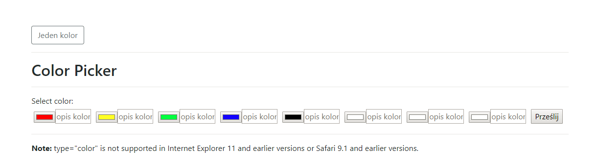
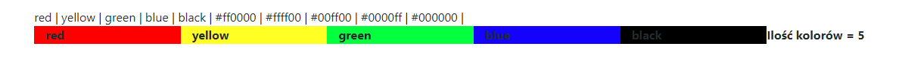

# color_input , multi_color
Input one or multi color. 
Program pozwala wybrać kolory i opisy.
Kolory bedą jako background opisu a wszystko wstawione do grid-ów 
<h2> Source:</h2>
 
<h2>Score:</h2>

