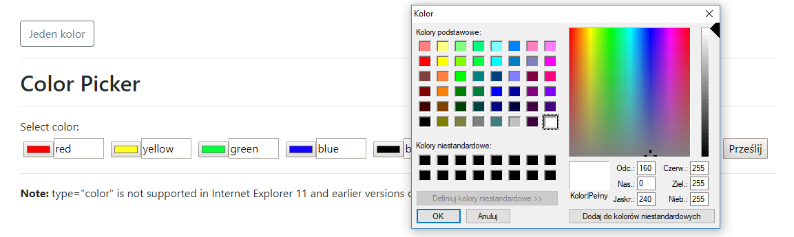
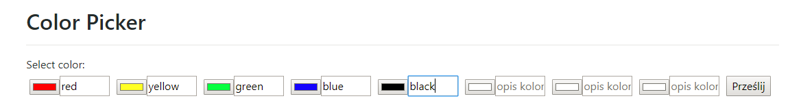

# color_input , multi_color, bootstrap
Input one or multi color for bootstrap. 
Program pozwala wybrać kolory i opisy.
Kolory bedą jako background opisu a wszystko wstawione do grid-ów 
<h2> View:</h2>
 
 
 

<h2>Score:</h2>

 <h2>Sourse:</h2>
https://www.w3schools.com/html/tryit.asp?filename=tryhtml_input_color
 <h2>Inspiration:</h2>
https://codepen.io/noahblon/details/ZbjmbK
 
<h2>License:</h2>
See the <a href="LICENSE.md">LICENSE </a>file for license rights and limitations (MIT).
